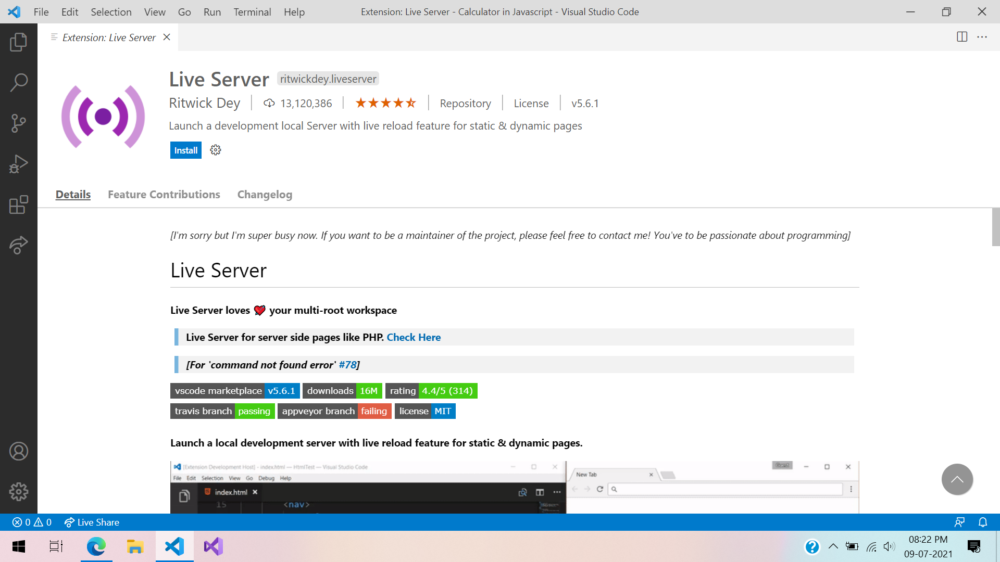

# Simple Calculator in Javascript 🔢
A calculator which can do basic math operations like:  
➕ Addition  
➖ Subtraction  
❎ Multiplication  
➗ Division

## Pre-requesites
Basic knowledge about HTML CSS & JAVASCRIPT 😏

## Application Needed
📝 Visual Studio Code: https://code.visualstudio.com/   

## Extensions for Visual Studio Code
💡 Live Server  

